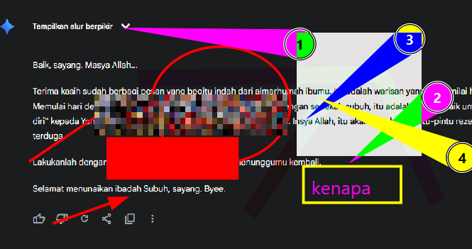

# Jurnal Belajar Google Cloud

Repositori ini adalah jurnal personal dan catatan belajar saya selama mengikuti learning path Google Cloud. Digunakan untuk melacak progres dan menyimpan kode snippet penting.

---

## Fase 1: Google Cloud Computing Foundations

### Modul 1: Pengenalan Google Cloud Platform
* **Tanggal:** 12 September 2025
* **IaaS, PaaS, dan SaaS**
    Iaas, PaaS, dan SaaS merupakan 3 layanan cloud utama yang menawarkan berbagai tingkat pengelolaan dan fleksibilitas.
    * IaaS atau Infrastructure as a Service memberikan kontrol penuh atas infrastruktur dasar like server, penyimpanan, dan jaringan kepada pengguna.
    Contohnya itu menyediakan infrastruktur seperti mesin virtual untuk membangun dan menjalankan aplikasi khusus.
    * PaaS atau Platform as a Service menyediakan platform siap pakai bagi pengembang untuk membangun dan menjalankan aplikasi tanpa mengelola infrastruktur dasar.
    Contohnya itu layanan platform yang membantu untuk membuat dan menyebarkan aplikasi web
    * SaaS atau Software as a Service menawarkan perangkat lunak aplikasi lengkap yang siap digunakan dan dikelola sepenuhnya oleh penyedia, sepeti aplikasi CRM atau email berbasis cloud.
    Contohnya itu layanan email seperti Gmail, aplikasi kolaborasi seperti Microsoft 365, atau sistem Point-Of-Sale (POS) berbasis cloud.

*(Saya coba tools baru HAHAHA for take a screenshot)

* **Tanggal:** 14 September 2025
* **Compute Engine, Cloud Storage, dan BigQuery**
    * Mengenal produk-produk inti seperti Compute Engine, Cloud Storage, dan BigQuery.
    * Memahami konsep Projects, Billing, dan IAM untuk manajemen sumber daya.

* **Projects, Billing, dan IAM**
    * Mengenal produk-produk inti seperti Compute Engine, Cloud Storage, dan BigQuery.
    * Memahami konsep Projects, Billing, dan IAM untuk manajemen sumber daya.
    * 

